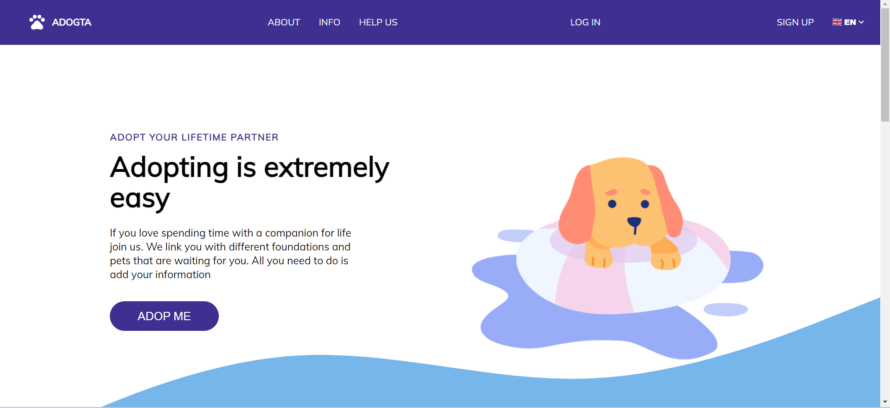
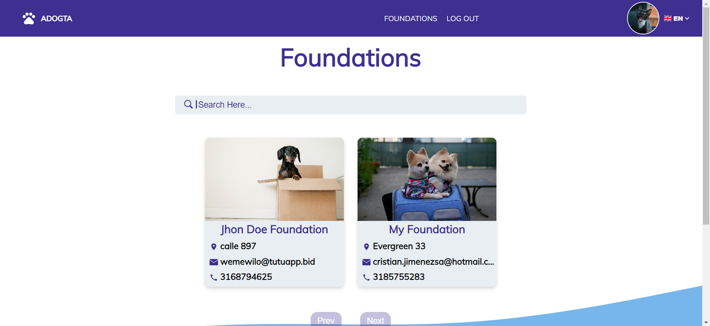
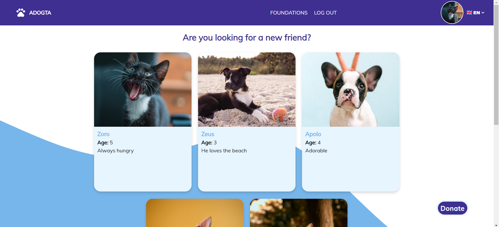
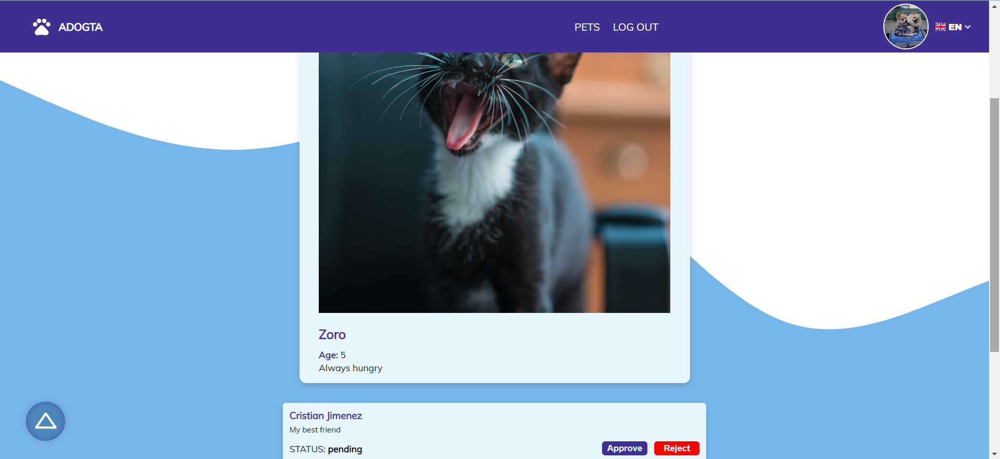
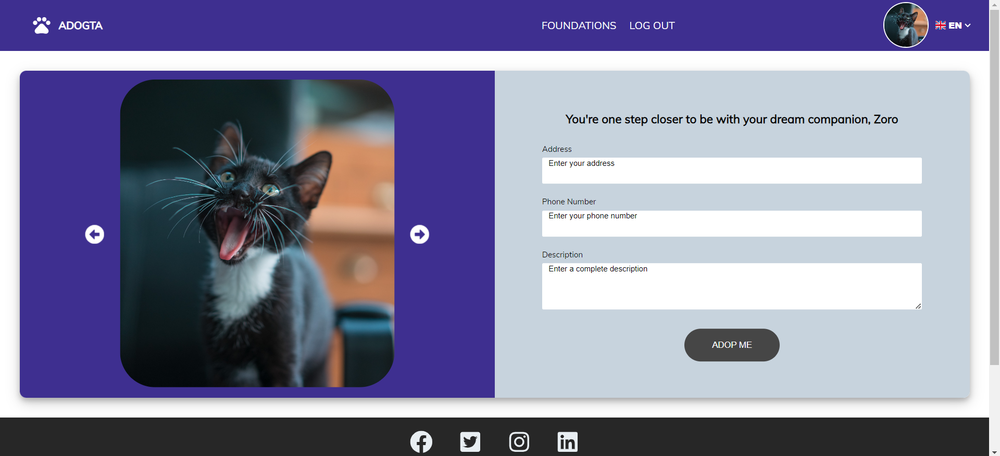
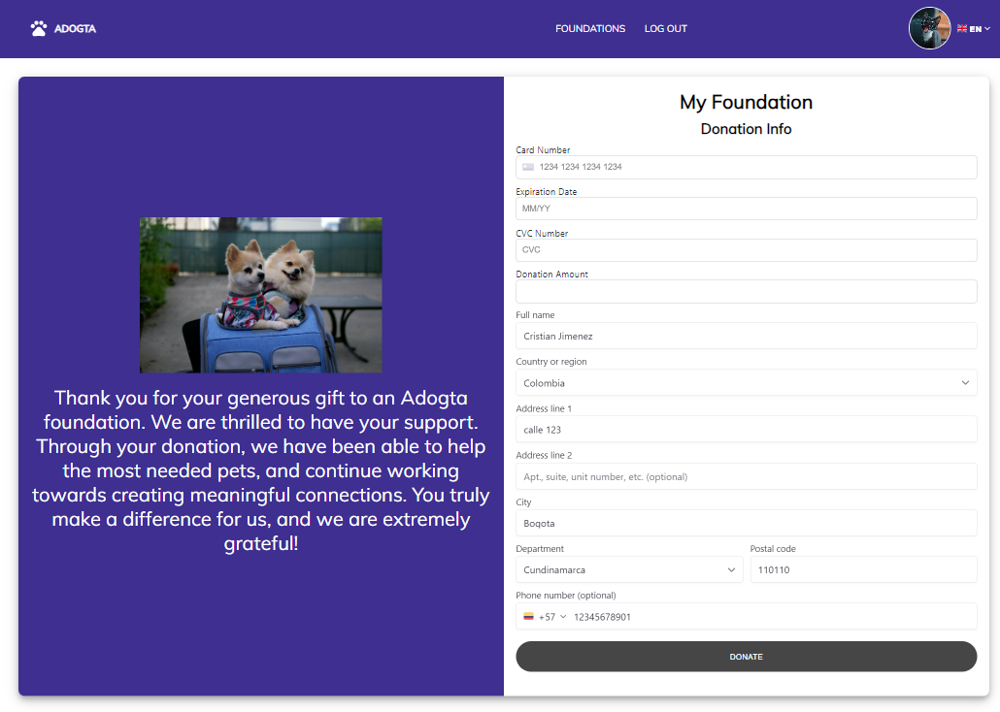
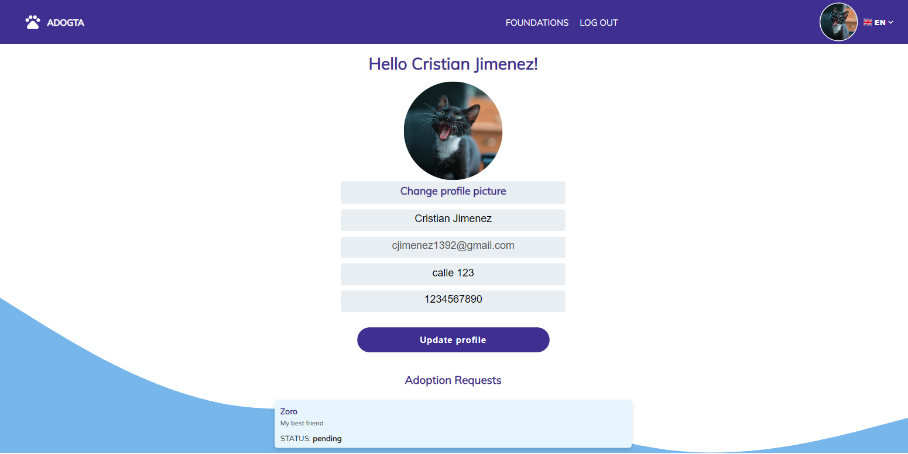

# Adogta App

## Table of contents 📄

- [Adogta App](#adogta-app)
  - [Table of contents 📄](#table-of-contents-)
  - [Overview :writing_hand:](#overview-writing_hand)
    - [Installation :gear:](#installation-gear)
    - [The Challenge :weight_lifting_man:](#the-challenge-weight_lifting_man)
    - [Screenshot 📷](#screenshot-)
    - [Built with 🛠️](#built-with-️)
  - [Author 👊](#author-)

## Overview :writing_hand:

Adogta is a web application that connects pet foundations with individuals interested in adopting a furry companion. As a user, you can browse through the foundation's page and view each of the pets they have available for adoption. If you find one you like, you can send an adoption request and wait for the foundation's response, or contribute to their cause by making a donation. As a foundation, you can create and manage pets through a highly intuitive interface.
The application connects to a backend API developed in Express to handle data. This repository contains the frontend structure. Here is the link to the backend repository: [Backend Repository](https://github.com/Cristianjs93/adogta-server), and the link to the deployed application on Vercel: [Deployed Project]()."

### Installation :gear:

To get started with the project, follow these steps:

1. Clone the repository:

```shell
git clone https://github.com/Cristianjs93/adogta-client
```

2. Navigate to the project directory:

```shell
cd adogta-client
```

3. Install the dependencies:

```shell
 npm install
```

4. Start the application:

```shell
 npm start
```

### The Challenge :weight_lifting_man:

The main challenge of this project is to develop a web application that allows efficient management of foundations, pets, donations, and the creation of unique users. Key functionalities include:

- User creation based on roles (USER, ADMIN, FOUNDATION)
- Add pets: Use the form to add new pets to the foundation through the backend API.
- Delete pets: Delete products from the pets database via the API with a single click.
- Edit profile: modify your profile information, photo and more using a single form and update the changes through the API.
- View Adoption request: the user profile displays the registered adoption request made in the app.

### Screenshot 📷


**_Home page_**
<br/>


**_Foundations page_**
<br/>


**_Pets page_**
<br/>


**_Pet detail_**
<br/>


**_Pet Adoption request_**
<br/>


**_Donation page_**
<br/>


**_User profile_**

### Built with 🛠️

- React: JavaScript library for building interactive user interfaces.
- CSS: easy and organized styling.
- API: The application consumes a backend API developed in Express to manage product data.

## Author 👊

This project was created by [Cristianjs93](https://github.com/Cristianjs93).
